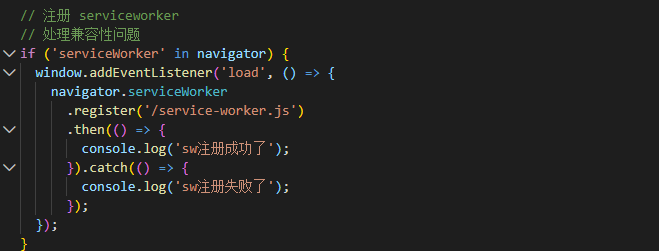

### PWA [Progressive Web Application]

- webpack 性能优化-PWA(离线访问技术)
- 首先，webpack 配置使用 workbox-webpack-plugin 这个插件，生成一个 serviceWorker 配置文件

### Step.

- 引入插件:
  
- 在 plugins 插件入口处引入插件
  
- 接着，在入口文件 index.js 中注册 serviceWorker
  
- 然后在修改 package.json 中 eslintConfig 配置,因为 eslint 不认识 window、navigator 等全局变量
  

```
 使用webpack打包
 然后运行代码:
 serviceWorke 必须运行在服务器上，所以需要启动服务器，
  1. 可以通过 node.js，运行
  2.全局安装 npm i serve -g
     然后启动服务器，将 build 目录下的所有资源作为静态资源暴露出去
    启动: serve -s buid
```
